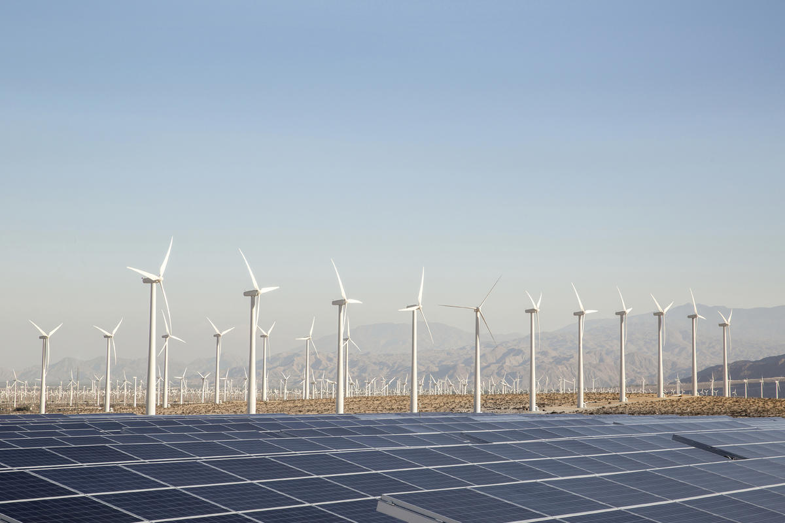

```{r load-packages, include = FALSE}
# Add any additional packages you need to this chunk
library(tidyverse)
library(tidymodels)
library(knitr)
library(xaringanthemer)
library(leaflet)
library(rgdal)
library(sf)
library(plotly)
library(gganimate)
library(gifski)
library(leafsync)
library(htmltools)
library(gridExtra)
library(ggpubr)
library(patchwork)
```

```{r setup, include=FALSE}
# For better figure resolution
knitr::opts_chunk$set(fig.retina = 3, dpi = 300, fig.width = 6, fig.asp = 0.618, out.width = "80%")
```


```{r load-data, include=FALSE}
energy <- read_csv("/cloud/project/data/WorldEnergyConsumption.csv")

alldata <- read_csv("/cloud/project/data/WorldEnergyConsumption.csv")

world_spdf <- readOGR( 
  dsn= ("/cloud/project/data/"), 
  layer="TM_WORLD_BORDERS_SIMPL-0.3",
  verbose=FALSE
)

world_spdf2 <- st_read("/cloud/project/data/TM_WORLD_BORDERS_SIMPL-0.3.shp")

# Clean the data object
library(dplyr)
world_spdf@data$POP2005[ which(world_spdf@data$POP2005 == 0)] = NA
world_spdf@data$POP2005 <- as.numeric(as.character(world_spdf@data$POP2005)) / 1000000 %>% round(2)

 
```

```{r clean-data, include=FALSE} 
cleandata <- alldata %>%
  filter(country %in% c("United States", "Canada", "United Kingdom", "Spain", "France", "Germany", "Switzerland", "Italy", "Norway", "Sweden", "Finland", "China", "Brazil", "India", "Russia", "Japan", "New Zealand", "Australia", "Africa", "South Africa"), year >= 1990) %>%
  select(country,
         year,
         wind_energy_per_capita, 
         wind_consumption, 
         wind_share_energy,
         wind_cons_change_twh,
         gdp, solar_energy_per_capita,
         solar_consumption, 
         solar_share_energy, 
         solar_cons_change_twh,
         renewables_energy_per_capita,
         renewables_consumption,
         renewables_cons_change_twh,
         renewables_share_energy, population,
         nuclear_consumption,
         nuclear_share_energy,
         nuclear_cons_change_twh,
         nuclear_energy_per_capita,
         hydro_share_energy,
         hydro_cons_change_twh,
         hydro_energy_per_capita,
         hydro_consumption,
         fossil_cons_change_twh,
         fossil_fuel_consumption,
         fossil_energy_per_capita,
         fossil_share_energy,
         energy_cons_change_twh,
         energy_per_gdp,
         energy_per_capita,
         biofuel_cons_change_twh,
         biofuel_share_energy,
         biofuel_cons_per_capita,
         biofuel_consumption)
#use this data for line plots etc (more consolidated country list)
```

```{r title-slide, include = FALSE}
style_xaringan(
  title_slide_background_image = "img/earth.jpeg"
)
```


## We see the impact of climate change in the news and all around us every day, but what are countries doing about it? 
- A recent report from the Intergovernmental Panel on Climate Change highlighted that the world needs to invest three to six times what it’s currently spending on mitigating climate change if it wants to limit global warming to 1.5 or 2 degrees Celsius (1)


- Although wealthier countries contribute the most to climate change, poor countries feel the effects disproportionately


.footnote[
[1] Source: Zhong, Raymond. “5 Takeaways From the U.N. Report on Limiting Global Warming.” The New York Times, 4 Apr. 2022, https://www.nytimes.com/2022/04/04/climate/ipcc-report-explained.html. Accessed 10 Apr. 2022. 
]
---
class: left, middle


## Our Data 
.pull-left[- Our data, "World Energy Consumption", consists of key metrics of energy usage from Kaggle. 
- This data set is part of Our World in Data, which seeks to collect data and research the world's largest problems. 
- The data set contained 122 columns of variables, and over 17,000 observations for each country from 1900 to the present. There were many observations which had “NA" as their entry.
- Our analysis is for 1990-2000 for selected countries of interest and their energy consumption

.footnote[
Image credit: Vanja Terzic/iStock.
]]
.pull-right[
```{r renewables, echo = FALSE, out.width = "90%", fig.align= "right", fig.cap = "Wind turbines and solar panels in Palm Springs, California."}



```
]


---
class: left

## A glimpse of energy consumption
```{r barchat-data, echo = FALSE, message = FALSE, warning = FALSE}
#cleaning data to make bar charts 
barchartdata <- alldata %>%
  filter(country %in% c("United States", "Canada", "United Kingdom", "Spain", "France", "Germany", "Switzerland", "Italy", "Norway", "Sweden", "Finland", "China", "Brazil", "India", "Russia", "Japan", "New Zealand", "Australia", "Africa", "South Africa"), year >= 1990) %>%
  select(country,
         year,
         wind_consumption, 
         solar_consumption, 
         nuclear_consumption,
         hydro_consumption,
         biofuel_consumption,
         coal_consumption,
         gas_consumption,
         oil_consumption)

barchartdata <- transform(barchartdata, overall_consumption = (wind_consumption+ 
         solar_consumption + 
         nuclear_consumption +
         hydro_consumption +
         biofuel_consumption +
         coal_consumption +
         gas_consumption +
         oil_consumption))


barcharttransform <- gather(barchartdata, key = "energy_type", value = "consumption", -country, -year, -overall_consumption)

barcharttransform <- barcharttransform[order(-barcharttransform$overall_consumption),]

barcharttransform$country <- factor(barcharttransform$country, 
 levels = unique(barcharttransform$country))
  
```
.center[
```{r barchart-transformed-fig, echo=FALSE, fig.height=3.5, fig.width=16, message=FALSE, warning=FALSE}
barcharttransform %>%
  filter(year >= 2000) %>%
  ggplot(aes(x = year, y = overall_consumption, fill = factor(energy_type, 
                                                   levels = c("oil_consumption",
                                                              "coal_consumption",
                                                              "gas_consumption",
                                                              "nuclear_consumption",
                                                              "wind_consumption", 
                                                              "solar_consumption", 
                                                              "hydro_consumption", 
                                                              "biofuel_consumption")))) +
  geom_bar(position="stack", stat="identity") + 
  facet_wrap(vars(country)) + 
  labs(title = "Energy consumption by country",
       subtitle = "2000-2020",
       x = "Year",
       y = "Primary Energy Consumption (TWh)",
       fill = "Energy Type") + 
  theme_minimal() + 
  scale_fill_brewer(palette = "RdYlGn", labels = c("Oil", "Coal", "Gas", "Nuclear", "Wind", "Solar", "Hydro", "Biofuel"))
```
]
---
class: left

## Distribution of energy in China and US
.center[
```{r china-usa-bar, echo=FALSE, out.height= "200%", message=FALSE, warning=FALSE}
barchartchinausa <- barcharttransform %>%
  filter(country %in% c("United States", "China"), year >= 2000)

fig <- ggplot(data = barchartchinausa, aes(x = year, 
                                     y = overall_consumption, 
                                     fill = factor(energy_type, 
                                                   levels = c("oil_consumption",
                                                              "coal_consumption",
                                                              "gas_consumption",
                                                              "nuclear_consumption",
                                                              "wind_consumption", 
                                                              "solar_consumption", 
                                                              "hydro_consumption", 
                                                              "biofuel_consumption")) )) +
  geom_area() + 
  facet_wrap(vars(country)) + 
  labs(title = "Energy consumption by for China and the USA",
       subtitle = "2000-2020",
       x = "Year",
       y = "Primary Energy Consumption (TWh)",
       fill = "Energy Type") + 
  theme_minimal()  + 
  scale_fill_brewer(palette = "RdYlGn", labels = c("Oil", "Coal", "Gas", "Nuclear", "Wind", "Solar", "Hydro", "Biofuel"))
fig

```
]
---
class: inverse, bottom
background-image: url(https://miro.medium.com/max/1400/1*iA0-8OxW4UWFsp151oR2rg.jpeg)
# Which countries have improved their share of renewable energy the most between 1990-2018?


---
```{r leaflet-data, echo = FALSE, include = FALSE, message = FALSE, warning = FALSE}
leaflettdata <- alldata %>%
  filter(year >= 1990) %>%
  select(country,
         year,
         wind_energy_per_capita, 
         wind_consumption, 
         wind_share_energy,
         wind_cons_change_twh,
         gdp, solar_energy_per_capita,
         solar_consumption, 
         solar_share_energy, 
         solar_cons_change_twh,
         renewables_energy_per_capita,
         renewables_consumption,
         renewables_cons_change_twh,
         renewables_share_energy, population,
         nuclear_consumption,
         nuclear_share_energy,
         nuclear_cons_change_twh,
         nuclear_energy_per_capita,
         hydro_share_energy,
         hydro_cons_change_twh,
         hydro_energy_per_capita,
         hydro_consumption,
         fossil_cons_change_twh,
         fossil_fuel_consumption,
         fossil_energy_per_capita,
         fossil_share_energy,
         energy_cons_change_twh,
         energy_per_gdp,
         energy_per_capita,
         biofuel_cons_change_twh,
         biofuel_share_energy,
         biofuel_cons_per_capita,
         biofuel_consumption,
         carbon_intensity_elec)
#use this data for leaflets - uses all countries 
```

```{r 2018-data-leaflet, echo = FALSE, include = FALSE, message = FALSE, warning = FALSE}
testleaflet <- leaflettdata %>%
  filter(year == "2018")
```

```{r filter-worldspdf-hippo, echo = FALSE, include = FALSE, message = FALSE, warning = FALSE}
testleaflet <- testleaflet %>% 
  left_join(world_spdf2, by = c("country" = "NAME")) %>%
  st_as_sf()
```

```{r recent-leaflet, echo = FALSE, message = FALSE, include = FALSE, warning = FALSE}
#2018 leaflet 
pal2 <- colorNumeric(palette = "RdYlGn", domain = testleaflet$renewables_share_energy)
labels <- sprintf("<strong>%s</strong><br/>%s ", testleaflet$country, testleaflet$renewables_share_energy) %>%
  lapply(htmltools::HTML)

m <- leaflet(data = testleaflet) %>% 
  addTiles()  %>% 
  setView( lat=10, lng=0 , zoom=1) %>%
  addPolygons(fillColor = ~pal2(testleaflet$renewables_share_energy),
                                 fillOpacity = 1, 
                                 color = "white",
                                 opacity = 0.7,
                                 weight = 1,
                                 label = labels) %>%
  addLegend("bottomleft", pal = pal2, values = ~testleaflet$renewables_share_energy,
    title = "2018 Renewable<br> Energy Share",
    opacity = 1)

m

```

```{r 1990-data-leaflet, echo = FALSE, message = FALSE, include = FALSE, warning = FALSE}
ninetyleaflet <- leaflettdata %>%
  filter(year == "1990")
```

```{r filter-worldspdf, echo = FALSE, message = FALSE, include = FALSE, warning = FALSE}
ninetyleaflet <- ninetyleaflet %>% 
  left_join(world_spdf2, by = c("country" = "NAME")) %>%
  st_as_sf()
```

```{r ninety-leaflet, echo = FALSE, message = FALSE, include = FALSE, warning = FALSE}
pal2 <- colorNumeric(palette = "RdYlGn", domain = ninetyleaflet$renewables_share_energy)
labels <- sprintf("<strong>%s</strong><br/>%s ", ninetyleaflet$country, ninetyleaflet$renewables_share_energy) %>%
  lapply(htmltools::HTML)

b <- leaflet(data = ninetyleaflet) %>% 
  addTiles()  %>% 
  setView( lat=10, lng=0 , zoom=1) %>%
  addPolygons(fillColor = ~pal2(ninetyleaflet$renewables_share_energy),
                                 fillOpacity = 1, 
                                 color = "white",
                                 opacity = 0.7,
                                 weight = 1,
                                 label = labels) %>%
  addLegend("bottomleft", pal = pal2, values = ~ninetyleaflet$renewables_share_energy,
    title = "1990 Renewable<br> Energy Share",
    opacity = 1) 
b
```
class: center, middle
```{r final-leaflet, echo = FALSE, message = FALSE, warning = FALSE}
leafsync::sync(b,m, ncol = 2, sync = "all")
```
---
class: left
## Are China and the US committed to reducing fossil fuels? 
.center[
```{r fossil-fuel-consumption-plot, out.width="100%", fig.width=2.5, echo=FALSE, message=FALSE, warning=FALSE}
fossildata <- cleandata %>%
  select(fossil_fuel_consumption, year, country) %>%
  filter(country == c("United States", "China")) %>%
  mutate(year = year - 1990)


fossil_fuel_graph <- ggplot(data = fossildata, mapping = aes(x = year, 
                                        y = fossil_fuel_consumption, 
                                        color = country)) +
  geom_point() + geom_smooth(se = FALSE) + 
  theme_minimal() +
  labs(title = "Fossil Fuel Consumption for China and the United States",
       subtitle = "By year",
       x = "Year",
       y = "Fossil Fuel Consumption (TWh)",
       color = "Country")

ggplotly(fossil_fuel_graph)
```
]
---
class: left 
## What do these trends look like in the future? 
```{r fossil-predictions-china, echo = FALSE, message = FALSE, include = FALSE, warning = FALSE}
year_1990_china <- fossildata %>%
  filter(country == "China") %>%
  select(country, year, fossil_fuel_consumption)

a <- c('China', 32, NA)
b <- c('China', 34, NA)
c <- c('China', 36, NA)
d <- c('China', 38, NA)
e <- c('China', 40, NA)
year_1990_china <- rbind(year_1990_china, a)
year_1990_china <- rbind(year_1990_china, b)
year_1990_china <- rbind(year_1990_china, c)
year_1990_china <- rbind(year_1990_china, d)
year_1990_china <- rbind(year_1990_china, e)

year_1990_china$year <- as.numeric(year_1990_china$year)

 
m_china <- linear_reg() %>%
  set_engine("lm") %>%
  fit(fossil_fuel_consumption ~ year, data = year_1990_china)
  
new_fossil_china <- data.frame(year = seq(1990, 2030, by = 2), country =
                                rep("China", 21 ))
new_fossil_china <- new_fossil_china %>% 
  mutate(predicted = predict(m_china, year_1990_china)$.pred, actual =
           year_1990_china$fossil_fuel_consumption)
```

```{r fossil-predictions-USA, echo = FALSE, message = FALSE, include = FALSE, warning = FALSE}
year_1990_USA <- fossildata %>%
  filter(country == "United States") %>%
  select(country, year, fossil_fuel_consumption)

a <- c('United States', 32, NA)
b <- c('United States', 34, NA)
c <- c('United States', 36, NA)
d <- c('United States', 38, NA)
e <- c('United States', 40, NA)
year_1990_USA <- rbind(year_1990_USA, a)
year_1990_USA <- rbind(year_1990_USA, b)
year_1990_USA <- rbind(year_1990_USA, c)
year_1990_USA <- rbind(year_1990_USA, d)
year_1990_USA <- rbind(year_1990_USA, e)
year_1990_USA$year <- as.numeric(year_1990_USA$year)

 
m_USA <- linear_reg() %>%
  set_engine("lm") %>%
  fit(fossil_fuel_consumption ~ year, data = year_1990_USA)
  
new_fossil_USA <- data.frame(year = seq(1990, 2030, by = 2), country =
                                rep("United States", 21 ))

new_fossil_USA <- new_fossil_USA %>% 
  mutate(predicted = predict(m_USA, year_1990_USA)$.pred, 
         actual = year_1990_USA$fossil_fuel_consumption) 
```
.center[
```{r USA-vs-China-fossil-predictions, echo = FALSE, message = FALSE, warning = FALSE}
fossil_preds <- rbind(new_fossil_china, new_fossil_USA)
ggplot(data = fossil_preds, mapping = aes(color = country)) + 
  geom_smooth(data = fossil_preds, mapping = aes(x = year, 
                                                 y = as.numeric(predicted))) + 
  geom_point(data = fossil_preds, mapping = aes(x = year,
                                                y = as.numeric(actual))) + 
  labs(y = 'Fossil Fuel Consumption',
       x = 'Year',
       color = 'Country',
       subtitle = 'Actual vs. Projected Data',
       title = 'Fossil Fuel Consumption in the USA and China since 1990') +
  theme_minimal() +
  geom_label(mapping = aes(x = 2010,
                           y = 40000,
                           label = 'R^2 China: .946  R^2 USA:  .141'))
```
]
---
class: inverse, left, top
background-image: url(https://www.science.org/do/10.1126/science.aax7477/abs/solar_16x9_2.jpg)
### Who are the leaders in renewables: breaking down the difference between total consumption and per capita

---
class: left 
## Leaders in Wind 
.pull-left[
```{r wind-consumption-all_countries-plot, echo=FALSE, out.width = "50%", out.height = "50%", message=FALSE, warning=FALSE}
wind_consumption_data <- cleandata %>%
  filter(year >= 2000) %>%
  select(wind_consumption, year, country) 

wind_consumption_graph <- ggplot(data = wind_consumption_data, mapping = aes(x = year, 
                                        y = wind_consumption, 
                                        color = country))+
  stat_smooth(geom='line', alpha=0.5, se=FALSE) + 
  theme_minimal() + 
  labs(title = "Wind Consumption in the Past 20 Years",
       subtitle = "For select countries of interest",
       x = "Year",
       y = "Primary Energy from Wind (TWh)")  

ggplotly(wind_consumption_graph)
```
]
.pull-right[
```{r wind-consumption-per-capita-all_countries-plot, out.width = "50%", out.height = "50%", fig.alt= "Line graph of wind consumption per capita per country per year."}
wind_energy_per_capita_data <- cleandata %>%
  filter(year >= 2000) %>%
  select(wind_energy_per_capita, year, country) 

wind_energy_per_capita_graph <- ggplot(data = wind_energy_per_capita_data, mapping = aes(x = year,
                                        y = wind_energy_per_capita, 
                                        color = country))+
  stat_smooth(geom='line', alpha=0.5, se=FALSE) + 
  theme_minimal() + 
  labs(title = "Wind Energy per Capita in the Past 20 Years",
       subtitle = "For select countries of interest",
       x = "Year",
       y = "Primary Energy from Wind per Capita (TWh)")

ggplotly(wind_energy_per_capita_graph)

```

]


---
# Layouts


You can use plain text

- or bullet points

.pull-left[
or text in two columns $^*$
]
.pull-right[
- like
- this
]

.footnote[
[*] And add footnotes
]

---

# Code

---

# Plots

---


```

```{r leaflet-join-spatial}
# leaflettdata <- leaflettdata %>% 
#  left_join(world_spdf2, by = c("country" = "NAME")) %>%
 #st_as_sf()
```


```{r recode-species, echo = FALSE}
# In this chunk I'm doing a bunch of analysis that I don't want to present 
# in my slides. But I need the resulting data frame for a plot I want to present.
iris_modified <- iris %>%
  mutate(Species = fct_other(Species, keep = "setosa"))
```

```{r plot-iris, echo = FALSE}
# Code hidden with echo = FALSE
# Uses modified iris dataset from previous chunk
# Play around with height and width until you're happy with the look
ggplot(data = iris_modified, mapping = aes(x = Sepal.Width, y = Sepal.Length, color = Species)) +
  geom_point() + 
  theme_minimal() # theme options: https://ggplot2.tidyverse.org/reference/ggtheme.html
```

---

## Plot and text

.pull-left[
- Some text
- goes here
]
.pull-right[
```{r warning=FALSE, out.width="100%", fig.width=4, echo=FALSE}
# see how I changed out.width and fig.width from defaults
# to make the figure bigger

```
]

---

# Tables

If you want to generate a table, make sure it is in the HTML format (instead of Markdown or other formats), e.g.,

```{r iris-table, echo = FALSE}
kable(head(iris), format = "html")
```

---

# Images

```{r castle, echo = FALSE, out.width = "60%", fig.align = "center", fig.cap = "Image credit: Photo by Jörg Angeli on Unsplash."}
include_graphics("https://images.unsplash.com/photo-1535448033526-c0e85c9e6968?ixlib=rb-1.2.1&ixid=eyJhcHBfaWQiOjEyMDd9&auto=format&fit=crop&w=1650&q=80")
```

Or you can also include a full page image. See next slide.

---

background-image: url(https://images.unsplash.com/photo-1535448033526-c0e85c9e6968?ixlib=rb-1.2.1&ixid=eyJhcHBfaWQiOjEyMDd9&auto=format&fit=crop&w=1650&q=80)

---

# Math Expressions

You can write LaTeX math expressions inside a pair of dollar signs, e.g. &#36;\alpha+\beta$ renders $\alpha+\beta$. You can use the display style with double dollar signs:

```
$$\bar{X}=\frac{1}{n}\sum_{i=1}^nX_i$$
```

$$\bar{X}=\frac{1}{n}\sum_{i=1}^nX_i$$

Limitations:

1. The source code of a LaTeX math expression must be in one line, unless it is inside a pair of double dollar signs, in which case the starting `$$` must appear in the very beginning of a line, followed immediately by a non-space character, and the ending `$$` must be at the end of a line, led by a non-space character;

1. There should not be spaces after the opening `$` or before the closing `$`.

1. Math does not work on the title slide (see [#61](https://github.com/yihui/xaringan/issues/61) for a workaround).

---

# Feeling adventurous?

- Want to find out more about `xaringan`? See https://slides.yihui.name/xaringan/#1.

- You are welcomed to use the default styling of the slides. In fact, that's what I expect majority of you will do. You will differentiate yourself with the content of your presentation.

- But some of you might want to play around with slide styling. The 
`xaringanthemer` provides some solutions for this that: https://pkg.garrickadenbuie.com/xaringanthemer.

- And if you want more bells and whistles, there is also `xaringanExtra`: https://pkg.garrickadenbuie.com/xaringanExtra.
